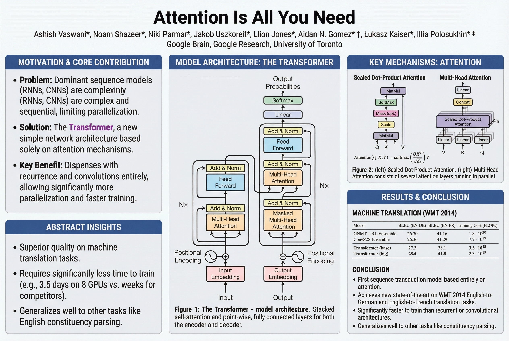
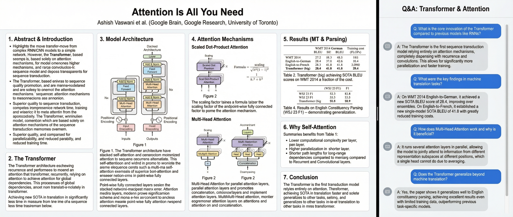
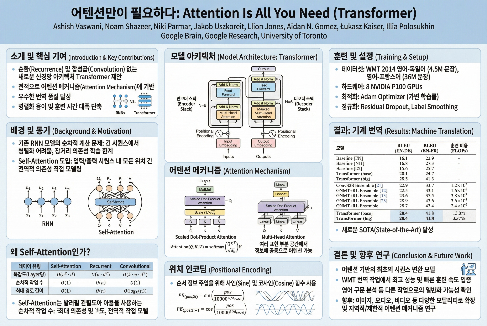
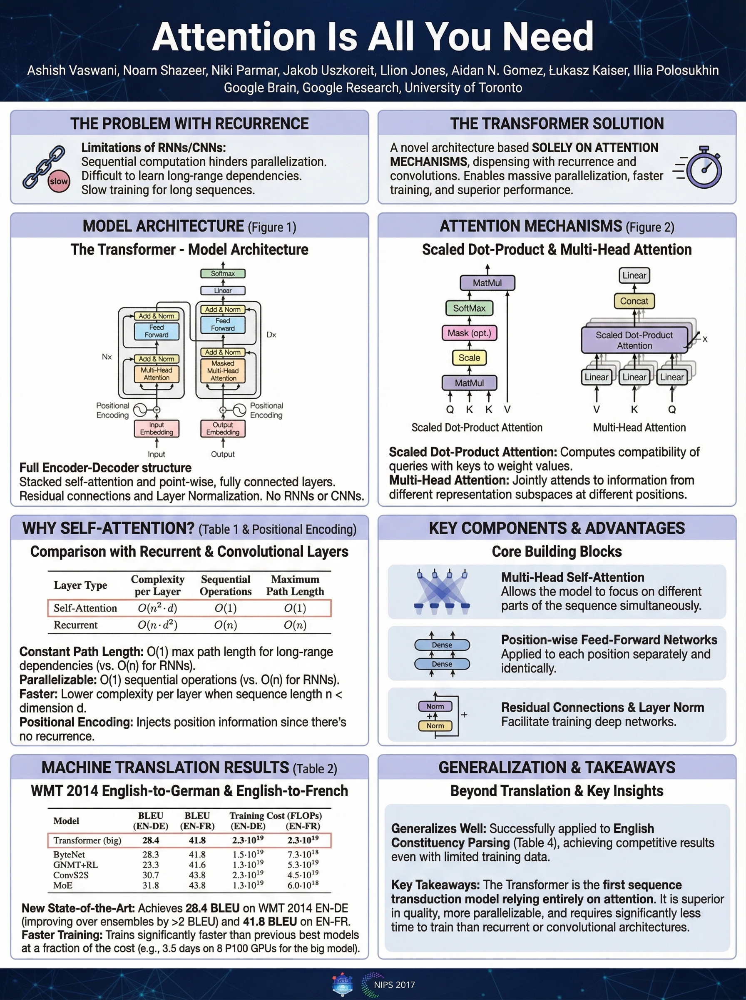
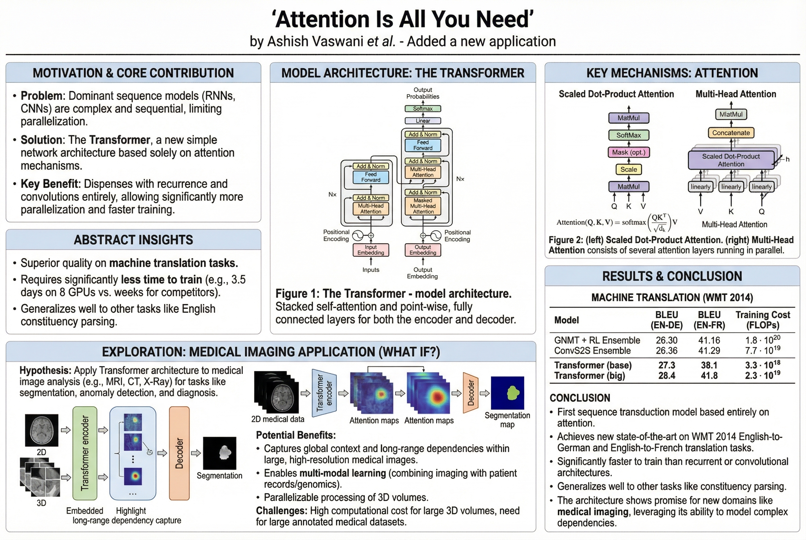
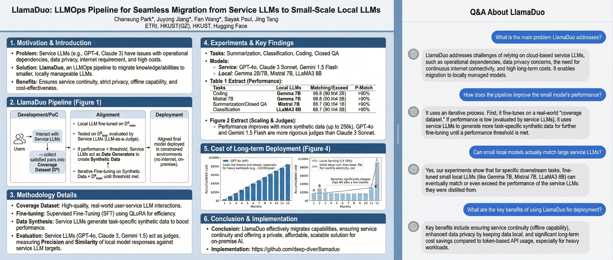

# Automating Academic Poster Generation with arxiv2poster: From Research Papers to Visual Presentations

*Published: November 29, 2025*

Academic poster creation has long been a time-consuming task for researchers. From designing layouts to selecting key information, the process can take hours—time that could be better spent on research itself. Enter **arxiv2poster**, a command-line tool that leverages Google's Gemini Image Generation models to automatically transform arXiv research papers into beautiful, publication-ready poster images.

## What is arxiv2poster?

`arxiv2poster` is an open-source CLI tool that takes an arXiv paper ID and generates a professional academic poster in seconds. Built on Google's Nano Banana Pro (Gemini 3.0 Image Generation) and Nano Banana (Gemini 2.5 Flash Image) models, it understands the full context of research papers and creates visually appealing posters that highlight key insights, methodologies, and findings.

### Key Features

- **Automatic PDF Processing**: Downloads and analyzes entire arXiv papers
- **Multiple Orientations**: Landscape (3:2) and portrait (3:4) formats
- **Side Panel Options**: Optional Q&A chat interface for interactive presentations
- **Multi-language Support**: Generate posters in any language (English, Korean, Spanish, Japanese, etc.)
- **What-If Variations**: Explore alternative ideas and applications on top of existing work
- **Batch Processing**: Generate multiple posters in one command
- **High-Resolution Output**: Up to 4K resolution with Pro model

## Getting Started

### Installation

```bash
# Clone the repository
git clone <repository-url>
cd arxiv2poster

# Install in development mode
pip install -e .
```

### Setup

1. Get a Google AI Studio API key from [Google AI Studio](https://ai.google.dev/gemini-api/docs/image-generation)
2. Set the API key as an environment variable:
   ```bash
   export GEMINI_API_KEY="your-api-key-here"
   ```

### Basic Usage

The simplest command generates a standard landscape poster:

```bash
arxiv2poster 1706.03762
```

This creates `outputs/poster_1706.03762_landscape_english_nopanel.png`—a clean, professional poster for the famous "Attention Is All You Need" paper.



*Figure 1: Standard landscape poster for "Attention Is All You Need" (arXiv:1706.03762)*

## Exploring Features

### 1. Side Panel with Q&A Interface

One of the most innovative features is the optional Q&A side panel. When enabled with `--side-panel qa`, the tool creates a side-by-side layout with the academic poster on the left and an interactive Q&A chat interface on the right.

```bash
arxiv2poster 1706.03762 --side-panel qa
```



*Figure 2: Landscape poster with Q&A chat interface showing common questions and answers*

The Q&A panel displays up to 4 common questions that researchers might ask about the paper, with answers directly based on the paper's content. This makes posters more interactive and informative for conference presentations.

### 2. Multi-Language Support

Research is global, and so should be poster generation. The `--language` option allows you to generate posters in any language:

```bash
arxiv2poster 1706.03762 --language Korean
```



*Figure 3: Same paper, generated in Korean*

All content—including titles, labels, and side panel text—is automatically translated and generated in the specified language.

### 3. Portrait Orientation

Sometimes portrait orientation works better for your presentation space:

```bash
arxiv2poster 1706.03762 --orientation portrait
```



*Figure 4: Portrait orientation poster (3:4 aspect ratio)*

### 4. What-If Variations

The "what if" feature is particularly powerful for exploring alternative applications or extensions of research. It takes an existing poster and generates a variation incorporating a new idea:

```bash
# First, generate the base poster
arxiv2poster 1706.03762

# Then, create a variation with a "what if" idea
arxiv2poster 1706.03762 --whatif "What if we apply this transformer architecture to medical imaging?"
```



*Figure 5: Variation exploring medical imaging applications*

This generates `poster_1706.03762_landscape_english_nopanel_var_1.png`, maintaining the original structure while incorporating the new concept. You can create multiple variants (var_1, var_2, etc.) to explore different ideas.

### 5. Different Papers, Different Styles

Let's see how it handles a different type of paper. Here's a poster for "LlamaDuo: LLMOps Pipeline for Seamless Migration from Service LLMs to Small-Scale Local LLMs" (arXiv:2408.13467):

```bash
arxiv2poster 2408.13467 --side-panel qa
```



*Figure 6: Poster for a different paper with Q&A side panel*

The tool adapts to different paper types, automatically adjusting the layout and content to best represent each research work.

## Advanced Usage

### Batch Processing

Generate multiple posters at once:

```bash
arxiv2poster 1706.03762 2408.13467 --orientation landscape --language English
```

### High-Resolution Output

For print-quality posters, use the Pro model with 4K resolution:

```bash
arxiv2poster 1706.03762 --model pro --resolution 4K --orientation landscape
```

### Custom Output Directory

Organize your posters:

```bash
arxiv2poster 1706.03762 --output-dir my_conference_posters
```

## Technical Architecture

### How It Works

1. **PDF Download**: The tool downloads the arXiv paper PDF using the paper ID
2. **Full Document Analysis**: The entire PDF is uploaded to Gemini, which analyzes all content including figures, tables, and text
3. **Intelligent Layout Generation**: Based on the paper's content, Gemini creates an appropriate layout with:
   - Prominent title display
   - Key insights and findings
   - Visual elements from the paper
   - Methodology highlights
   - Results and conclusions
4. **Side Panel Generation** (if enabled): For Q&A panels, Gemini generates realistic questions and answers based on the paper content
5. **Image Generation**: The final poster is generated as a high-resolution PNG image

### Model Options

- **Nano Banana Pro** (`--model pro`): Higher quality, supports resolution options (1K, 2K, 4K)
- **Nano Banana** (`--model flash`): Lighter and more cost-effective, suitable for quick iterations

## Use Cases

### 1. Conference Presentations

Generate professional posters for academic conferences without spending hours in design software. The tool ensures consistent, high-quality output every time.

### 2. Research Communication

Create multiple language versions of your poster for international audiences or multilingual conferences.

### 3. Idea Exploration

Use the "what if" feature to quickly visualize how your research could be applied to different domains or extended in various directions.

### 4. Teaching Materials

Generate visual summaries of important papers for teaching, making complex research more accessible to students.

## Best Practices

1. **Start Simple**: Begin with the default settings, then customize as needed
2. **Use Q&A for Presentations**: The side panel is excellent for interactive poster sessions
3. **Explore Variations**: Use "what if" to generate multiple perspectives on your research
4. **Language Considerations**: Generate posters in the language of your target audience
5. **Resolution for Print**: Use 4K resolution when printing large-format posters

## Future Possibilities

The `--side-panel` architecture is designed for extensibility. Future versions could support:
- **Summary Panel**: Key takeaways and abstract
- **Methodology Panel**: Detailed methodology visualization
- **Keypoints Panel**: Bullet-point summary of main contributions
- **Timeline Panel**: Research timeline or related work

## Conclusion

`arxiv2poster` represents a significant step forward in automating academic communication. By combining the power of large language models with image generation, it transforms the tedious task of poster creation into a simple command-line operation. Whether you're preparing for a conference, exploring research variations, or creating teaching materials, this tool can save hours while producing professional-quality results.

The ability to generate posters in multiple languages, explore "what if" scenarios, and include interactive Q&A panels makes it a versatile tool for the modern researcher. As the project continues to evolve, we can expect even more features that further streamline academic communication.

## Getting Involved

`arxiv2poster` is an open-source project. Contributions, feedback, and feature requests are welcome. Check out the repository to get started, and don't forget to star it if you find it useful!

---

*All posters in this blog post were generated using arxiv2poster with Google's Gemini Image Generation models. The papers featured are:*
- *"Attention Is All You Need" (arXiv:1706.03762) by Vaswani et al.*
- *"LlamaDuo: LLMOps Pipeline for Seamless Migration from Service LLMs to Small-Scale Local LLMs" (arXiv:2408.13467) by Park et al.*

